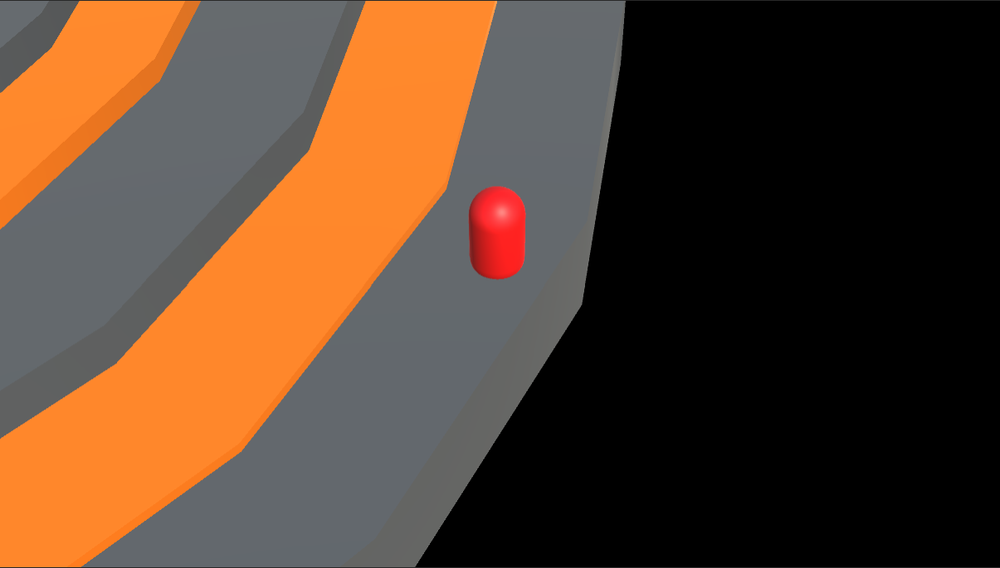

<h1>Metronome of Dissonance: The Action-Adventure Audio-Only Video Game for the Visually Impaired Players</h1>
<h2>Download the game for free from Itch.io:</h2> 

https://henrysfriman.itch.io/the-metronome-of-dissonance-demo

<h2>Introduction</h2>

I created this audio game prototype as a part of my thesis, in which I investigated the evolution of accessibility in video games

The game was made with Unity, and it was inspired by both my own personal tastes and some of the highly acclaimed audio-based video games

I made the game audio-only (by hiding the visual elements) in order to put every player in the same position.

The game contains audio instruction (made with Narakeet voice generator), as well as distinctive sound effects that resemble different aspects of the game.

<b>NOTE: SINCE THIS GAME IS AUDIO-ONLY, ALL OF THE VISUALS SHOWN IN THE SCREENSHOTS BELOW ARE HIDDEN IN THE ACTUAL GAME</b>

<h2>Game Logic</h2>

In this game, you play as an entity who is stuck in a world with no physical shape. Your main goal is to recognize the distant ticking of a metronome, and move to the right direction in order to find it. The game consists of two different stages, which are referred to as a Labyrinth and an Orbital

<h3>Stage 1: Labyrinth</h3>

In this stage, the game logic is the following:

<ul>
  <li>When you are at the crossroads, you can listen to the metronome. Recognize the direction of that sound and press either Left, Up, Down, or Right Arrow. You will move (and turn) automatically based on the button you pressed.</li>  
  

      
  

  <li>When encountering enemies, you will stop moving: in this fight sequence, you have to do the following:
    <ul>
      <li>You have to listen to the enemies around you (in your left, right and in front of you). Each of them can have up to 3 different sound effects (low-pitched)</li>
      <li>Press either 1, 2, or 3 button to select one of the three high-pitched sound effects that resemble the sound effects of enemies, and then press either Left, Up, or Right Arrow in order to "shoot that sound" towards the enemy</li>
      <li>If you shot the correct sound effect towards the enemy, they will be destroyed. But be careful: the enemies will attack you if you are not quick enough</li>
      <li>When the enemies are destroyed, the player keeps moving automatically until they encounter new enemies or another crossroads</li>
      <li>If you take enough damage, however, you will respawn to the previous crossroads.
    </ul>  
      

          
      

    </li>
  <li>When encountering so-called Shadow Traps, the following things happen:
    <ul>
      <li>You will hear a low buzz sound. Press Space immediately in order to survive the trap.</li>
      <li>If you are not quick enough, you will be destroyed by the trap and respawn to the previous crossroads.
    </ul>  
    

        
  </li>
  <li>Other dangers include:
    <ul>
      <li>Dead Ends, also known as Void Zones. There is nothing you can do when encountering them, and you will respawn back to the previous crossroads</li>
      <li>Time Limit: if you will not find the metronome in five minutes, the game will end</li>
    </ul>
  </li>
</ul>
 
  <b>The closer you are to the metronome, the louder you can hear it. Find the metronome in order to get to the stage 2</b>
 
  

        
  

 

<h3>Stage 2: Orbital</h3>

In this stage, the game logic is the following:

  <ul>
    <li>you are rotating around the constantly ticking metronome. You have to find the bridges that will get you closer to the center, where the metronome is</li>  
      

          
      
  
    <li>When encountering bridges, the following things will happen:</li>
      <ul>
        <li>You will hear a sound that indicates the direction of the center</li>
        <li>Press either Left, Up, or Right Arrow key based on the direction of the sound</li>
        <li>If you pressed the correct key (in the right time), you will move closer to the center and start rotating again</li>
        <li>If you did not manage to press the correct key in the right time, you will keep rotating in the same distance until you encounter the same bridge again</li>
      </ul>  
      

          
      
  
    <li>In addition to bridges, there are also cage traps that may trap you, which will cause you to bounce back-and-forth inside the cage. If this happens, you have to do the following:</li>
    <ul>
      <li>Listen to the bouncing sounds and try to recognize when you are in the excact middle spot of the cage</li>
      <li>When you believe to have found the middle spot, press Space key immediately.</li>
      <li>If you pressed the Space key at the right time, the trap will disappear, and you will keep rotating in the direction you were being bounced back to<./li>
      <li>If you did not manage to press the Space key, you will just keep bouncing inside the cage until you manage to succeed.</li>
       
      

          
      
  
    </ul>
    <li>There is also a time limit as in the Stage 1.</li>
  </ul>
 
  <b>
    Reach the center of the orbital and get the metronome before the time runs out
  </b>

         

      
  
